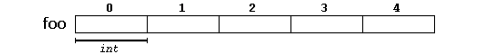
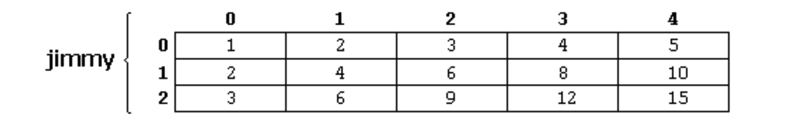

# Arrays
陣列是放置在連續記憶體的一系列相同類型的元素，並且可以透過索引方式依序地存取內容。例如，一個包含5個int類型整型值的陣列foo可以表示為:



其中每個空白面表示陣列的一個元素。在本例中，這些是int類型的值。這些元素從0到4編號，0在第一個，4在 最後一個;在c++中，陣列的第一個元素總是用0(而不是1)作為起始點。

## 陣列初始化
初始化一個陣列可以事先給定空間大小，又或是透過初始值的設定動態的給予空間。

```c
int foo [5] = { 16, 2, 77, 40, 12071 };
int bar [5] = { 16, 2, 77 };
int baz [5] = {};
int foo [] = { 16, 2, 77, 40, 12071 };
```

以下兩種寫法是在 C++ 中允許的初始化方式：

```c
int foo[] = { 10, 20, 30 };
int foo[] { 10, 20, 30 };
```

## 陣列取值
以下範例是定義一個空間為5的陣列，並將第三個位置賦值75。

```c
 int foo[5];         // declaration of a new array
foo[2] = 75;        // access to an element of the array.
```

以下例子建立一個 foo 陣列並給予初值，接著透過迴圈走訪陣列取得每一個數值並累加取得結果。

```c
// arrays example
#include <iostream>
using namespace std;
int foo [] = {16, 2, 77, 40, 12071};
int n, result=0;
int main () {
  for ( n=0 ; n<5 ; ++n )
  {
    result += foo[n];
  }
  cout << result;
return 0; 
}
```

輸出結果：
```
12206
```

## 多維陣列
向量可視為一維陣列，矩陣可視二維陣列，對於維度超過1的陣列則均可視為多維陣列。

```c
#define WIDTH 5
#define HEIGHT 3
int jimmy [HEIGHT][WIDTH];
int n,m;
int main () {
  for (n=0; n<HEIGHT; n++)
    for (m=0; m<WIDTH; m++)
    {
      jimmy[n][m]=(n+1)*(m+1);
    }
}
```



## 函式中傳入陣列
在函式中若有陣列作為輸入的參數，可以直接以陣列名稱表示。

```c
// arrays as parameters
#include <iostream>
using namespace std;
void printarray (int arg[], int length) {
  for (int n=0; n<length; ++n)
    cout << arg[n] << ' ';
  cout << '\n';
}
int main () {
  int firstarray[] = {5, 10, 15};
  int secondarray[] = {2, 4, 6, 8, 10};
  printarray (firstarray,3);
  printarray (secondarray,5);
}
```

輸出結果：
```
5 10 15
2 4 6 8 10
```

## Array 庫
C++ 提供 array 庫可以使用陣列作為容器。

```c
#include <iostream>
#include <array>
using namespace std;
int main() {
  array<int,3> myarray {10,20,30};
  for (int i=0; i<myarray.size(); ++i)
    ++myarray[i];
  for (int elem : myarray)
    cout << elem << '\n';
}
```