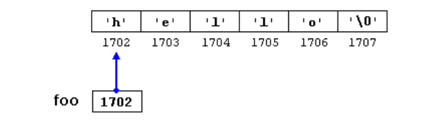

# Pointers
指針就是用來指向記憶體的位置。對於一個c++程式，電腦中的記憶體就像一個連續的記憶單元，每個字節大小每個都有一個唯一的地址。這些單字節存儲單元的排列方式允許大於一個字節的數據表示佔用具有連續地址的存儲單元。

- `&` 取得記憶體位置
- `*` 從記憶體取值

在變數前加上 `&` 符號就是取得該變數的地址。以下範例中 foo 是存記憶體位置(指向)，bar 是存放數值內容。

```c
myvar = 25;
foo = &myvar;
bar = myvar;
```


`*` 符號是用來獲取指針指向地址所對應的內容。比如說剛剛例子 foo 是指像一個記憶體位置，若要取得數值就可以在該變數前加上 `*`。

```c
baz = *foo;
```


## 指標宣告
下面為指針三種類型的定義，每個變數都透過指針指向不同數據類型。

```c
int * number;
char * character;
double * decimals;
```

以下例子透過指標為兩個變數 firstvalue, secondvalue 進行賦值。

```c
// my first pointer
#include <iostream>
using namespace std;
int main () {
  int firstvalue, secondvalue;
  int * mypointer;
  mypointer = &firstvalue;
  *mypointer = 10;
  mypointer = &secondvalue;
  *mypointer = 20;
  cout << "firstvalue is " << firstvalue << '\n';
  cout << "secondvalue is " << secondvalue << '\n';
  return 0;
}
```

輸出結果：
```
firstvalue is 10
secondvalue is 20
```

再來看更進階範例，首先透過 p1 指標修改 firstvalue 變成 10。同時把 p2 指標所存取的內容指向跟 p1 一樣的記憶體位置，此時的 secondvalue 變為 10。最後兩行再將 secondvalue 的數值修改成 20。
```c
// more pointers
#include <iostream>
using namespace std;
int main () {
  int firstvalue = 5, secondvalue = 15;
  int *p1, *p2;
  p1 = &firstvalue;  // p1 = address of firstvalue
  p2 = &secondvalue; // p2 = address of secondvalue
  *p1 = 10; // value pointed to by p1 = 10
  *p2 = *p1; // value pointed to by p2 = value pointed to by p1
  p1 = p2; // p1 = p2 (value of pointer is copied)
  *p1 = 20; // value pointed to by p1 = 20
 
  cout << "firstvalue is " << firstvalue << '\n';
  cout << "secondvalue is " << secondvalue << '\n';
  return 0;
}
```

輸出結果：
```
firstvalue is 10
secondvalue is 20
```

## Pointers and arrays
陣列的概念與指針有關。事實上，陣列的工作方式非常類似於指向第一個元素的指針，而且陣列總是可以隱式地轉換為適當類型的指針。例如，考慮以下兩個宣告方式:

```c
int myarray [20];
int * mypointer;
```

下面的賦值操作是有效的，陣列 myarray 名稱其實就是該陣列的第一個元素 `[0]` 的記體位置。
```c
mypointer = myarray;
```

以下範例建立一個 numbers 陣列，並透過指標走訪為 numbers 陣列的五個元素進行賦值。
```c
// more pointers
#include <iostream>
using namespace std;
int main () {
  int numbers[5];
  int * p; 
  p = numbers; *p = 10; 
  p++; *p = 20; // 此動作會移動四個字節
  p = &numbers[2]; *p = 30; 
  p=numbers+3; *p=40; 
  p = numbers; *(p+4) = 50; 
  for (int n=0; n<5; n++)
      cout << numbers[n] << ", ";
  return 0;
}
```

輸出結果：
```
10, 20, 30, 40, 50, 
```

因此陣列若要為某個索引的內容更新數值也可以透過指標方式修改。以下寫法兩個都是等價的：
```c
a[5] = 0;       // a [offset of 5] = 0
*(a+5) = 0;     // pointed to by (a+5) = 0
```

## 指針初始化
我們可以定義一個 myvar 變數以及指針變數 myptr，然後透過 `&` 符號將 myvar 的記憶體位置賦予 myptr 作為初始化。

```c
int myvar;
int * myptr = &myvar;
```

記住若要透過 `*` 解引用來對某變數修改數值前必須先將 myptr 指向該變數的記憶體位置。
```c
#include <iostream>
using namespace std;
int main () {
  int myvar=5;
  int *myptr=&myvar;
  *myptr=20;
  cout<< "myptr: " << *myptr<<endl;
  cout<< "myvar:" << myvar<<endl;
  return 0;
}
```

## 指針運算
指針只允許記憶體得加減位置計算，並根據它們所指向的數據類型大小進行記憶體位置的移動。假設現在我們在編譯器中定義了三個指針，若分別指向內存位置 1000 2000 3000。

```c
char *mychar; // 一個字節
short *myshort; // 兩個字節
long *mylong; // 四個字節
```

因此，如果我們寫:

```c
++mychar;
++myshort;
++mylong;
```


如我們所料，此時 mychar 位置變成 1001。myshort 變成 2002 最後的 mylong 將變成 3004。儘管它們每個只增加了一次。原因是當給指針加1時，指針將指向同一類型的下一個元素。因此指針所指向的類型的字節 大小將被添加到指針上。以上寫法等同於：

```c
mychar = mychar + 1;
myshort = myshort + 1;
mylong = mylong + 1;
```

指標位置走訪跟解引用取得數值必須瞭解清楚，以免搞混。
```c
#include <iostream>
using namespace std;
int main () {
  int num[]={1,2,3};
  int *myptr=num;
  cout<< "num[0]: " << *myptr <<endl; // 1
  cout<< "num[0]:" << *myptr++ <<endl; // 1 先取值記憶體位置再移動
  cout<< "num[1]: " << *myptr <<endl; // 2
  cout<< "num[2]:" << *++myptr <<endl; // 3
  cout<< "num[2]+1: " << ++*myptr <<endl; // 4 num[2]直接+1
  cout<< "num[2]: " << (*myptr)++ <<endl; // 4 先取值再修改值+1
  cout<< "num[2]: " << *myptr <<endl; // 5 得到修改後的值
  cout<< "num[2]: " << num[2] <<endl; // 5 再次驗證確實有修改到
  return 0;
}
```

## Pointers and const
指針常數的意思是指該指針變數所指向的記憶體位置可以改變，但是裡面的值是無法更動的。

```c
int x;
int y = 10;
const int * p = &y;
x = *p;          // ok: reading p
*p = x;          // error: modifying p, which is const-qualified
```


以下例子陣列透過指針常數的走訪，顯示陣列的內容以及更動陣列每個元素。
```c
// pointers as arguments:
#include <iostream>
using namespace std;
void increment_all (int* start, int* stop)
{
  int * current = start;
  while (current != stop) {
    ++(*current);  // increment value pointed
    ++current;     // increment pointer
} }
void print_all (const int* start, const int* stop)
{
  const int * current = start;
  while (current != stop) {
    cout << *current << '\n';
    ++current;     // increment pointer
  }
}
int main () {
  int numbers[] = {10,20,30};
  increment_all (numbers,numbers+3);
  print_all (numbers,numbers+3);
  return 0;
}
```

以下是更嚴謹的定義常數：
```c
int x;
      int *       p1 = &x;  // 一般指針位置與數值都可以任意變更
const int *       p2 = &x;  // 記憶體位置指向的內容不可變更(常用)
      int * const p3 = &x;  // 指標所對應的地址不可變更
const int * const p4 = &x;  // 記憶體位置與內容都無法變更
```

## Pointers and string literals
接下來要討論指針與字串。字元陣列其實也可以透過一個指標來表示。

```c
char * foo = "hello";
```

假設 `hello` 儲存在 1702 為開始的記憶體位置，我們可以將變數宣告表示為:



如果要取得第五個位置 `o` 的字元可以這樣寫：

```c
*(foo+4)
foo[4]
```

## Pointers to pointers
c++ 允許使用指向指针的指针。其實指針自己本身是有記憶體位置的，變數前加兩個星號代表可以儲存另一個指針的記憶體位置。

```c
char a;
char * b;
char ** c;
a = 'z';
b = &a;
c = &b;
```


## void pointers
這裡要介紹一個特殊類型的指針。void 表示沒有類型，因此空指針是指向沒有類型的值的指針空間大小也未知。所以任何類型的變數都能被它指向。它可能的用途之一是向函數傳遞泛型參數：

```c
// increaser
#include <iostream>
using namespace std;
void increase (void* data, int psize)
{
  if ( psize == sizeof(char) )
  { char* pchar; pchar=(char*)data; ++(*pchar); }
  else if (psize == sizeof(int) )
  { int* pint; pint=(int*)data; ++(*pint); }
}
int main () {
  char a = 'x';
  int b = 1602;
  increase (&a,sizeof(a));
  increase (&b,sizeof(b));
  cout << a << ", " << b << '\n';
  return 0;
}
```

## Invalid pointers and null pointers
如果定義一個指針，暫時不想指向任何位置可以這樣寫：

```c
int * p = 0;
int * q = nullptr;
```

## Pointers to functions
指針函數


