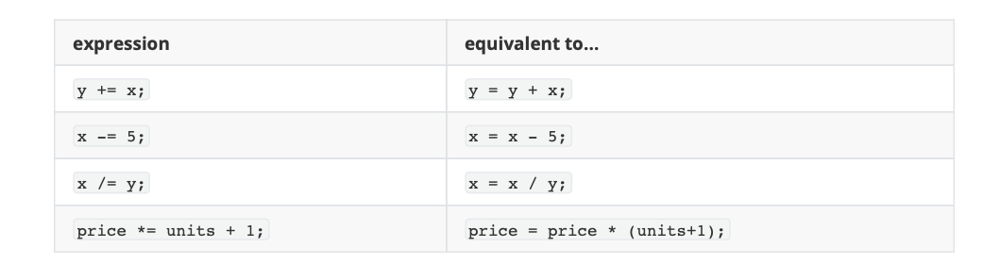
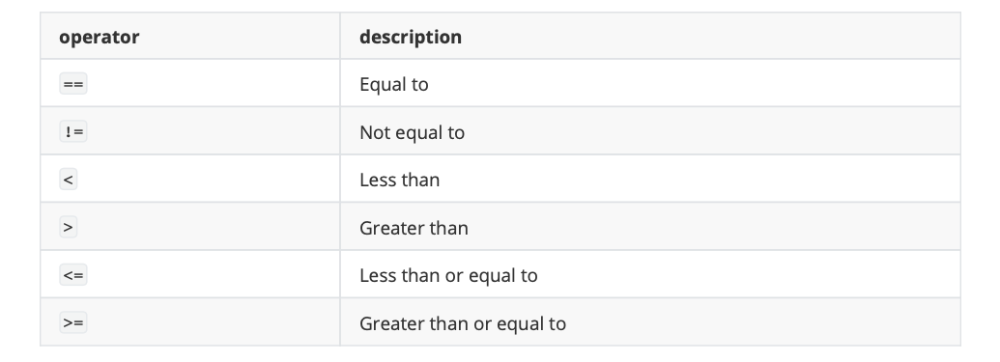

# Operators
一旦介紹了變數和常量，我們就可以開始使用運算子(Operators)來控制它們。

## Assignment operator (=)
賦值是將一個值賦給變數。以下範例將整數值 5 賦給變數 x 。賦值操作總是從右向左進行，而不是從左向右:

```c
x=5
```

## Arithmetic operators ( +, -, *, /, % )
c++ 所支援的五種算術運算子為：


加、減、乘、除運算字面上對應於它們各自的數學運算子。最後一個是 modulo 運算子，由百分號 `%` 表示，給出兩個值的除法的餘數。例如:

```c
x = 11 % 3;
```

結果變數 x 應該會為 2，因為 11 除以 3 得到 3，餘數為 2。

## Compound assignment (+=, -=, *=, /=, %=, >>=, <<=, &=, ^=, |=)
複合賦值運算子透過對變數執行操作來修改變數的當前值。它們相當於將一個操作的結果賦值給第一個操作數:



```c
// compound assignment operators
#include <iostream>
using namespace std;
int main () {
  int a, b=3;
  a = b;
  a+=2;             // equivalent to a=a+2
  cout << a;
}
```

## Increment and decrement (++, --)
有些陳述句還可以進一步簡化:遞增運算子 `++` 和遞減運算子 `——` 將存儲在變量中的值增加或減少一個。它們分 別等價於 `+=1` 和 `-=1`。因此:

```c
++x;
x+=1;
x=x+1;
```

> 在功能上都是相同的;它們三個都是x的值增加1。

但是若是在變數中賦予值時低曾和遞減運算子的前後擺放位置不同，將會得到不同結果。

```c
x = 3;
y = ++x;
// x contains 4, y contains 4
x = 3;
y = x++;
// x contains 4, y contains 3
```

## Relational and comparison operators ( ==, !=, >, <, >=, <= )
兩個表達式可以使用關係和相等操作符進行比較。例如，知道兩個值是否相等或是否一個大於另一個。結果將會得到一個布林值，真(true)或假(false)。



```c
(7 == 5) // evaluates to false
(5 > 4) // evaluates to true
(3 != 2) // evaluates to true
(6 >= 6) // evaluates to true
(5 < 5) // evaluates to false
```

當然，可以比較的不只是數值常量，而是任何值，當然包括變量。假設a=2, b=3, c=6，則:

```c
(a == 5)     // evaluates to false, since a is not equal to 5
(a*b >= c)   // evaluates to true, since (2*3 >= 6) is true
(b+4 > a*c)  // evaluates to false, since (3+4 > 2*6) is false
((b=2) == a) // evaluates to true
```

注意，賦值運算子(帶一個等號的運算子=)與相等比較的運算子(帶兩個等號的運算子==)不一樣;前者是將右邊的值賦給左邊的變數，而後者是比較運算符兩邊的值是否相等。因此，在最後一個表達式 `(b=2) == a ` 中， 我們首先將值 2 賦給 b ，然後將它與 a (也存儲值2)進行比較，得到結果為 true。、

## Logical operators ( !, &&, || )
