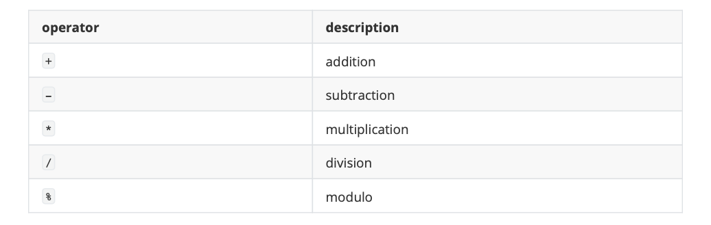

# Operators
一旦介紹了變數和常量，我們就可以開始使用運算子(Operators)來控制它們。

## Assignment operator (=)
賦值是將一個值賦給變數。以下範例將整數值 5 賦給變數 x 。賦值操作總是從右向左進行，而不是從左向右:

```c
x=5
```

## Arithmetic operators ( +, -, *, /, % )
c++ 所支援的五種算術運算子為：



加、減、乘、除運算字面上對應於它們各自的數學運算子。最後一個是 modulo 運算子，由百分號 `%` 表示，給出兩個值的除法的餘數。例如:

```c
x = 11 % 3;
```

結果變數 x 應該會為 2，因為 11 除以 3 得到 3，餘數為 2。

## Compound assignment (+=, -=, *=, /=, %=, >>=, <<=, &=, ^=, |=)
複合賦值運算子透過對變數執行操作來修改變數的當前值。它們相當於將一個操作的結果賦值給第一個操作數:


```c
// compound assignment operators
#include <iostream>
using namespace std;
int main () {
  int a, b=3;
  a = b;
  a+=2;             // equivalent to a=a+2
  cout << a;
}
```

## Increment and decrement (++, --)
有些陳述句還可以進一步簡化:遞增運算子 `++` 和遞減運算子 `——` 將存儲在變量中的值增加或減少一個。它們分 別等價於 `+=1` 和 `-=1`。因此:

```c
++x;
x+=1;
x=x+1;
```

> 在功能上都是相同的;它們三個都是x的值增加1。

但是若是在變數中賦予值時低曾和遞減運算子的前後擺放位置不同，將會得到不同結果。

```c
x = 3;
y = ++x;
// x contains 4, y contains 4
x = 3;
y = x++;
// x contains 4, y contains 3
```

## Relational and comparison operators ( ==, !=, >, <, >=, <= )
兩個表達式可以使用關係和相等操作符進行比較。例如，知道兩個值是否相等或是否一個大於另一個。結果將會得到一個布林值，真(true)或假(false)。


```c
(7 == 5) // evaluates to false
(5 > 4) // evaluates to true
(3 != 2) // evaluates to true
(6 >= 6) // evaluates to true
(5 < 5) // evaluates to false
```

當然，可以比較的不只是數值常量，而是任何值，當然包括變量。假設a=2, b=3, c=6，則:

```c
(a == 5)     // evaluates to false, since a is not equal to 5
(a*b >= c)   // evaluates to true, since (2*3 >= 6) is true
(b+4 > a*c)  // evaluates to false, since (3+4 > 2*6) is false
((b=2) == a) // evaluates to true
```

注意，賦值運算子(帶一個等號的運算子=)與相等比較的運算子(帶兩個等號的運算子==)不一樣;前者是將右邊的值賦給左邊的變數，而後者是比較運算子兩邊的值是否相等。因此，在最後一個表達式 `(b=2) == a ` 中， 我們首先將值 2 賦給 b ，然後將它與 a (也存儲值2)進行比較，得到結果為 true。、

## Logical operators ( !, &&, || )
邏輯運算子最常被用在 if...else 判斷式當中。透過布林值進行邏輯判斷。一般來說會有 &&(and) 與 ||(or) 還有 !(非)。邏輯運算子 && 和 || 用於計算兩個表達式以獲得單個關係結果。運算子 && 對應於布林邏輯操作AND，如果它的兩個操作數都是 true，則產生 true，否則產生 false。下面的面板顯示了運算子 && 求表達式 `a&&b` 的結果:


運算子 || 對應於布林邏輯運算 OR，如果其中一個操作數為`真`，則產生`真`，因此只有當兩個操作數都為假時才為`假`。以下是 `a||b` ˋ真值表的結果:


舉例：
```c
 ((5==5)&&(3>6)) // evaluates to false(true&&false) 
 ((5==5)||(3>6)) // evaluates to true(true||false)
```

在使用邏輯運算子時，c++只計算從左到右所需的結果，而忽略其餘的結果。因此，在最後一個例子 `(5==5)|| (3>6)` 中，c++首先判斷 `5==5` 是否為真，如果是，它就不檢查 `3>6` 是否為真。這被稱為`短路計算`，對這些運算子的工作原理如下:


## Conditional ternary operator ( ? )
三元運算子算是 if...else 單行的濃縮版。如果計算結果為 true 返回一個值，如果表達式計算結果為 false 則返回另一個值。它的語法是:

```
condition ? result1 : result2
```

```c
7==5 ? 4 : 3 // evaluates to 3, since 7 is not equal to 5.
7==5+2 ? 4 : 3 // evaluates to 4, since 7 is equal to 5+2.
5>3 ? a : b // evaluates to the value of a, since 5 is greater than 3.
a>b ? a : b // evaluates to whichever is greater, a or b.
```

在這個例子中， a是2，而b是7，因此正在計算的表達式 `a>b` 不是 true，因此在問號之後指定的第一個值被丟棄，取而代之的是第二個值(冒號後面的值)，即b(值為7)。
```c
// conditional operator
#include <iostream>
using namespace std;
int main () {
  int a,b,c;
  a=2;
  b=7;
  c = (a>b) ? a : b;
  cout << c << '\n';
}
```

## Comma operator ( , )
逗號運算子用於分隔兩個或多個表達式，這些表達式包含在只需要一個表達式的地方。當必須對表達式集求值時，只考慮最右邊的表達式。以下範例首先將值3賦給b，然後將 `b+2` 賦給變數a 。因此最後變數a將等於5，而變數b將等於3。

```c
a = (b=3, b+2);
```

## Bitwise operators ( &, |, ^, ~, <<, >> )
位元運算子根據表示變數所存儲值的 bit 模式來修改變數內容。


## Explicit type casting operator
明確類型轉換運算子允許將給定類型的值轉換為另一類型。在c++中有幾種方法可以做到這一點。最簡單的一個是從C語言繼承來的，是在要被括號()括起來的新類型轉換的表達式之前:

```c
int i;
float f = 3.14;
i = (int) f;
```

```c
i = int (f);
```

> 這兩種類型轉換方法在c++中都是有效的。

## sizeof
透過該運算子可以得知變數的大小(以字節為單位)。

```c
x = sizeof (char);
```

在這裡， x 被賦值為 1 ，因為 char 是一個大小為一個字節的類型。

> sizeof 返回的值是一個編譯時常數(ompile-time constant)，所以它在程式執行之前就確定內容。

## Other operators
在後面的章節中將會看到更多的運算子。例如指針的操作或是物件導向。

## Precedence of operators
一個表達式可以有多個運算子，而每個操作間有相對應的運算子優先序。以下範例第一行將6賦值給變數 x，因為 % '操運算子的優先級高於 + 操作符，並且總是在前面求值。表達式的部分可以括在括號中，以覆蓋此優先順序，或顯式地明確預期的效果。注意區別:

```c
 x=5+(7%2); // x=6(same as without parenthesis) 
 x=(5+7)%2; // x=0
 ```
