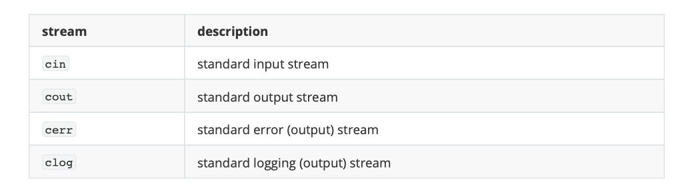

# Basic Input/Output
前面幾節的範例程式幾乎沒有與使用者進行互動。它們只是在螢幕上打印出簡單的值，但是標準庫透過其輸入/輸出特性提供了許多其他與使用者互動的方法。本節將簡要介紹一些最有用的方法。c++ 使用一種叫做 streams 的方法來執行連續媒體(如螢幕、鍵盤或文件)的輸入和輸出操作。標準庫對輸入/輸出定義了一些對象：



## Standard output (cout)
在 C 語言中若要在螢幕印出訊息可以使用 `printf()`。而在 C++ 中可以使用 `cout` 來印出訊息。對於格式化輸出操作，cout 與插入操作符一起使用，插入操作符寫成 `<<`(即兩個小於符號)。

```c
cout << "Output sentence"; // prints Output sentence on screen
cout << 120;               // prints number 120 on screen
cout << x; 
```

多個插入操作(<<)可以鏈接在一個語句中:

```c
cout << "This " << " is a " << "single C++ statement";
```

假設年齡變數為24，郵遞區號變數為90064，前面語句的輸出將是:

```c
cout << "I am " << age << " years old and my zipcode is " << zipcode;
```

```
I am 24 years old and my zipcode is 90064
```

cout 不會自動在句尾添加換行，除非有命令這樣做。例如，下面兩個語句插入 cout :

```c
cout << "This is a sentence.";
cout << "This is another sentence.";
```

輸出結果將為：

```c
This is a sentence.This is another sentence.
```

要插入換行符號必須在應該換行的確切位置插入換行字符。在c++中，一個換行字符可以指定為 `\n`。例如:

```c
cout << "First sentence.\n";
cout << "Second sentence.\nThird sentence.";
```

輸出結果：

```
First sentence.
Second sentence.
Third sentence.
```

又或者可以使用 `endl` 來換行。

```c
cout << "First sentence." << endl;
cout << "Second sentence." << endl;
```

輸出結果：

```
First sentence.
Second sentence.
```

## Standard input (cin)
在大多數程式環境中，預設的標準輸入是鍵盤，因此可以透過 `cin` 來向使用者取得輸入訊息。

```c
int age;
cin >> age;
```

若包含兩個以上的變數時，要以Space(空白鍵)，作為輸入間隔符號:

```c
cin >> a >> b;
```

```c
cin >> a;
cin >> b;
```

## cin and strings
cin 總是提取空格（空白鍵、tabs、換行）所取的值作為結束。若輸入一個句子則會被視為單字背節出來。因此要從 cin 獲取一個名為 getline 的函數，將透過 cin 讀取到的整行訊息存入字串型態的變數中。

```c
 
// cin with strings
#include <iostream>
#include <string>
using namespace std;

int main () {
  string mystr;
  cout << "What's your name? ";
  getline (cin, mystr);
  cout << "Hello " << mystr << ".\n";
  cout << "What is your favorite team? ";
  getline (cin, mystr);
  cout << "I like " << mystr << " too!\n";
  return 0;
}
```

以上範例對 mystr 重複兩次進行輸入的提取，因此第二次的輸入結果會直接覆蓋第一次的內容。

## stringstream
以下範例初始化一個值為1204的字串和一個類型為int的變數。然後，第三行使用 `stringstream()` 從字串中提取並存成數值變數。因此這段程式將數值 1204 存儲在名為 myint 的變數中。

```c
string mystr ("1204");
int myint;
stringstream(mystr) >> myint;
```

在這個例子中，我們間接地從標準輸入中獲取數值:我們不是直接從 cin 中提取數值，而是從 cin 中提取行到一個字串對象到(mystr)中，然後從這個字串中提取值到變數 price 和quantity 中。一旦這些值是數值，就可以對它們執行算術運算，例如將它們相乘以獲得總價。

```c
// stringstreams
#include <iostream>
#include <string>
#include <sstream>
using namespace std;
int main () {
  string mystr;
  float price=0;
  int quantity=0;
  cout << "Enter price: ";
  getline (cin,mystr);
  stringstream(mystr) >> price;
  cout << "Enter quantity: ";
  getline (cin,mystr);
  stringstream(mystr) >> quantity;
  cout << "Total price: " << price*quantity << endl;
  return 0;
}
```