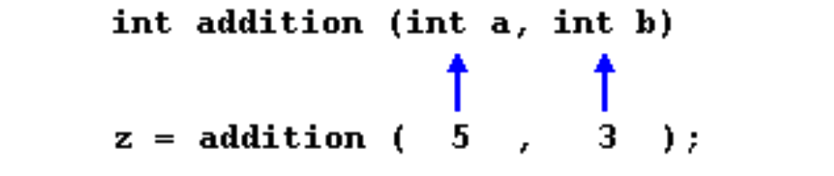
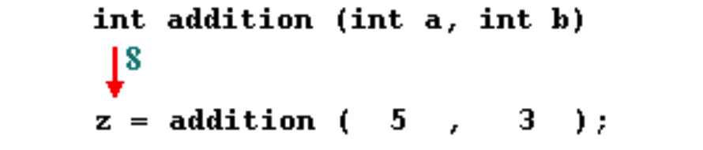
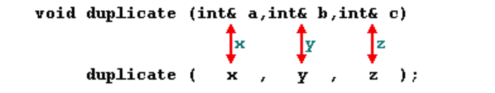
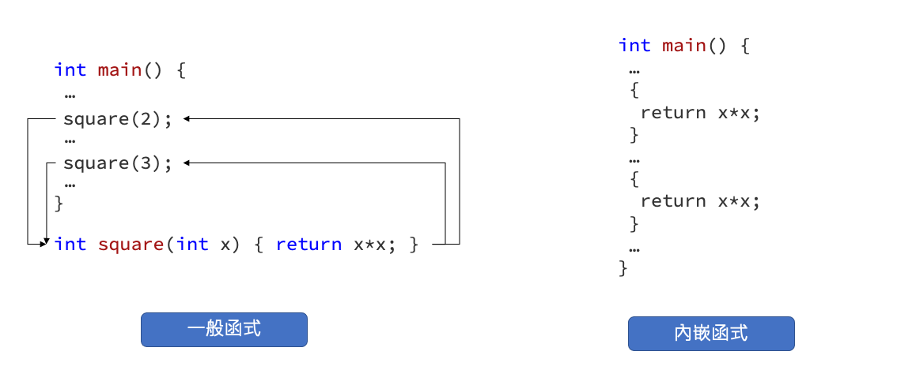

# Functions
Function的基本想法就是要讓程式化簡把容易重複的動作寫成一個函式。使用函式有以下的好處：

- 減少撰寫重覆的程式碼
- 將程式碼以有意義的方式組織起來
- 在相同的流程下，可藉由參數調整程式的行為
- 藉由函式庫可組織和分享程式碼
- 做為資料結構 (data structures) 和物件 (objects) 的基礎

## 返回值的函式
在下面例子中宣告一個函式 `addition()`，允許輸入兩個整數型態的變數並存放在 a, b。最後相加並回傳，因此在宣告此函式時必須在開頭標上 int 代表該函式會 return 一個整數型態的數值。最終在主程式 main() 被呼叫並將兩數相加結果回傳到 z 變數。



```c
// function example
#include <iostream>
using namespace std;
int addition(int a, int b)
{
  int r;
  r=a+b;
  return r;
}
int main() {
  int z;
  z = addition(5,3);
  cout << "The result is " << z;
```



> 一個函式可以被呼叫多次，傳入的參數也可以是變數，但要符合型態規範。

## 無返回值的函式 (void)
函式開頭宣告 void 即代表不會 return 任何東西。若該函式沒有傳入內容也可以為空 ()。以下範例 `printmessage()` 被呼叫後僅會列印出一段句子。

```c
// void function example
#include <iostream>
using namespace std;
void printmessage()
{
  cout << "I'm a function!";
}
int main() {
  printmessage();
}
```

## The return value of main
到這裡你可能會發現主程式 `main()` 返回類型是 int，但是平時我們在撰寫程式都會忽略沒有從 main 返回任何值。其原因是編譯器自動會幫你加上 `return 0;` 代表結束。

## Arguments passed by value and by reference
在先前的範例中函式的參數是按值傳遞。這意味著當呼叫此函式時，這些變數的數值被複製到由函式建立的變數中。以下範例就是所謂的傳值 passed by value。

```c
int x=5, y=3, z;
z = addition(x, y);
```

不過在某些情況下我們可以透過指標同時存取內部和外部的變數，因此參數可以透過指標位置傳遞。在 c++ 中，參數類型後面加上 & 符號表示引用記憶體位置。

```c
// passing parameters by reference
#include <iostream>
using namespace std;
void duplicate (int& a, int& b, int& c)
{
  a*=2;
  b*=2;
  c*=2;
}
int main () {
  int x=1, y=3, z=7;
  duplicate (x, y, z);
  cout << "x=" << x << ", y=" << y << ", z=" << z;
  return 0;
}
```



## Efficiency considerations and const references(提高函式執行效率與常數引用)
為了避免指標傳遞而誤改了變數內的數值，可以在型態前加上 `const` 即表示靜態變數。確保在該函式內不會對該變數做任何的變動或修改內容。

```c
string concatenate (const string& a, const string& b){
return a+b; 
}
```

## Inline functions
為了避免頻繁地呼叫函式所消耗大量記憶體，引入了 inline 表示為內嵌函式。內嵌函式是用來加速C++的執行速度，在程式碼的語法上不會有什麼太大的差異，但是在Compiler編譯時，卻會有不一樣的效果。

```c
inline int square(int x) { return x*x; }
```

一般函式被呼叫使用時，電腦的機器語言指令會紀錄目前工作階段的記憶體位址，然後跳至函式的記憶體位置處理完程序後，並回到原先的位址上，而這樣來回會造成時間上的額外負擔。而 C++ 提供這種內嵌函式，在編譯時便會把函式中的程式直接展開，進而節省效能。



> 現今編譯器會在比較簡單的函式自動添加 inline 關鍵字來優化程式。

## Default values in parameters
函數中可以定義預設參數，在呼叫函數時自動的給予初值。在以下範例中 `divide(12)` 未給予 b 值，呱呼叫時會自動預設將 b 賦予 2 並最後面的計算。

```c
// default values in functions
#include <iostream>
using namespace std;
int divide (int a, int b=2)
{
  int r;
  r=a/b;
  return (r);
}
int main () {
  cout << divide(12) << '\n';
  cout << divide(20,4) << '\n';
  return 0;
}
```

## Declaring functions 函式聲明
在先前例子中我們都是將函式宣告在 main 前面，若將定義的函數寫在 main 後面時就必須要有函式的聲明未程式碼添加可讀性。

```c
 
// declaring functions prototypes
#include <iostream>
using namespace std;
void odd (int x);
void even (int x);
int main()
{
int i;
  do {
    cout << "Please, enter number (0 to exit): ";
    cin >> i;
    odd (i);
  } while (i!=0);
return 0; }
void odd (int x)
{
  if ((x%2)!=0) cout << "It is odd.\n";
  else even (x);
}
void even (int x)
{
  if ((x%2)==0) cout << "It is even.\n";
  else odd (x);
}
```

## 遞迴
函式可以自己呼叫自己。下面例子為一個費氏數列。

```c
// factorial calculator
#include <iostream>
using namespace std;
long factorial (long a)
{
  if (a > 1)
   return (a * factorial (a-1));
  else
   return 1;
}
int main () {
  long number = 9;
  cout << number << "! = " << factorial (number);
  return 0;
}
```

## Reference
- [[C 語言] 程式設計教學：如何撰寫函式 (Function)](https://opensourcedoc.com/c-programming/function/)